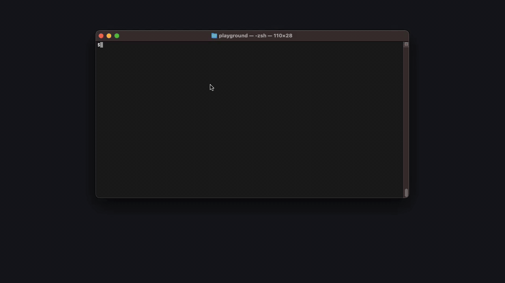
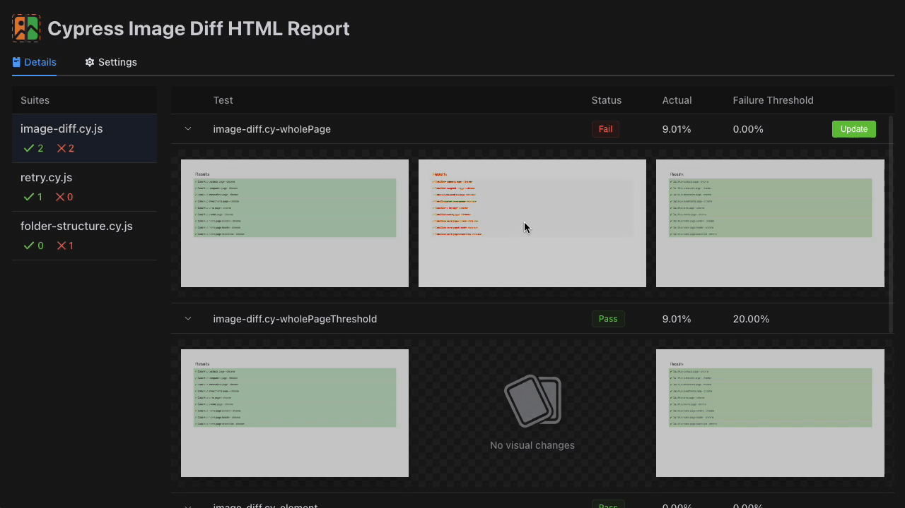
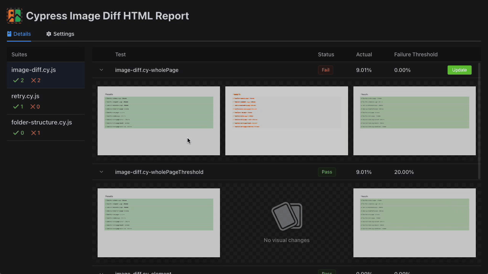

<p align="center">
	<a href="#"></a>
</p>

<h1 align="center">cypress-image-diff-html-report</h1>

## Overview

A HTML reporting module for Cypress-Image-Diff to parse the JSON output into a beautiful report



### Update baseline screenshots



### Provide with light/dark/system default theme



## Installation

Make sure you install [Cypress](https://www.cypress.io/) and [cypress-image-diff](https://cypress.visual-image-diff.dev/getting-started/cypress-integration) prior to this report installation.

```
npm install -D cypress-image-diff-html-report
```

## Project setup

Once you've installed the package, you are good to go without any further configuration. However, you can create a configuration file if you do want more custom configurations. `cypress-image-diff-html-report` will look for the `cypress-image-diff-html-report.config.js` file under the root of your project.

You can use the `defineConfig` helper which provides intellisense:

```
import { defineConfig } from 'cypress-image-diff-html-report'

export default defineConfig({
  // config options
})
```

If you’d like to specify a different config filename than the default, use the --configFile command line option.

See all available configurations [here](#all-available-options-in-the-cli-api-and-config-files).

## CLI

This is the most common way to use `cypress-image-diff-html-report`.
It supports two commands: `generate` and `start`.

- `generate`: generates the HTML report and writes to disk wherever it's designated.

  ```
  cypress-image-diff-html-report generate [options]
  ```

- `start`: starts a local server, which will serve the HTML report on the fly. You don't need to run `generate` before this command if you don't want to write the HTML report to your disk.

  ```
  cypress-image-diff-html-report start [options]
  ```

See all available CLI options [here](#all-available-options-in-the-cli-api-and-config-files).

## API

`cypress-image-diff-html-report` can be used to programmatically generate reports or start a local server. Whichever option is available via CLI is also available in the API. It is useful to use the API if you need more flexibility or to integrate with other third parties.

- `generate`:

  ```
  import { generate } from 'cypress-image-diff-html-report'

  ;(async () => {
    await generate({
      configFile: 'custom.config.js',
      // ...
    })
  })()
  ```

- `start`:

  ```
  import { start } from 'cypress-image-diff-html-report'

  ;(async () => {
    await start({
      configFile: 'custom.config.js',
      serverPort: 3000
      // ...
    })
  })()
  ```

See all available API options [here](#all-available-options-in-the-cli-api-and-config-files).

## Example integration

Run `generate` as soon as all the tests are executed.

```
// package.json
{
  "scripts": {
    "test:e2e": "cypress run --headless && cypress-image-diff-html-report generate --configFile my-visual-html-report.config.js"
  }
}
```

Often times you want to serve the HTML report locally to perform snapshot update features. Run the `start` command when the json report is in place:

```
cypress-image-diff-html-report start --configFile my-visual-html-report.config.js
```

## All available options in the CLI, API, and config files

### Config file options

| Options         | Type      | Description                                                                                             | Default value                               |
| --------------- | --------- | ------------------------------------------------------------------------------------------------------- | ------------------------------------------- |
| `inputJsonPath` | `string`  | Specify the input json file, relative to the `process.cwd()`                                            | `cypress-image-diff-html-report.input.json` |
| `outputDir`     | `string`  | Set the output directory of the generated HTML report, relative to the `process.cwd()`                  | `cypress-image-diff-html-report`            |
| `baseDir`       | `string`  | Specify the base directory for all the interal paths in the input json, relative to the `process.cwd()` | `''`                                        |
| `inlineAssets`  | `boolean` | Whether to inline all screenshots to base64 for the generated HTML                                      | `false`                                     |
| `autoOpen`      | `boolean` | Open the HTML report in the default browser as soon as the server starts                                | `false`                                     |
| `serverPort`    | `number`  | Set the port of the local server                                                                        | `6868`                                      |

### Generate options

| CLI                          | API options     | Type      | Description                                                                                                   | Default value                               |
| ---------------------------- | --------------- | --------- | ------------------------------------------------------------------------------------------------------------- | ------------------------------------------- |
| `-c, --configFile`           | `configFile`    | `string`  | Specify config file, will be overwritten by other config options if provided, relative to the `process.cwd()` | `cypress-image-diff-html-report.config.js`  |
| `-i, --inputJsonPath <file>` | `inputJsonPath` | `string`  | Specify the input json file, relative to the `process.cwd()`                                                  | `cypress-image-diff-html-report.input.json` |
| `-o, --outputDir <dir>`      | `outputDir`     | `string`  | Set the output directory of the generated HTML report, relative to the `process.cwd()`                        | `cypress-image-diff-html-report`            |
| `--baseDir <dir>`            | `baseDir`       | `string`  | Specify the base directory for all the interal paths in the input json, relative to the `process.cwd()`       | `''`                                        |
| `--inlineAssets`             | `inlineAssets`  | `boolean` | Whether to inline all screenshots to base64 for the generated HTML                                            | `false`                                     |

### Start options

| CLI                          | API options     | Type      | Description                                                                                                   | Default value                               |
| ---------------------------- | --------------- | --------- | ------------------------------------------------------------------------------------------------------------- | ------------------------------------------- |
| `-c, --configFile`           | `configFile`    | `string`  | Specify config file, will be overwritten by other config options if provided, relative to the `process.cwd()` | `cypress-image-diff-html-report.config.js`  |
| `-i, --inputJsonPath <file>` | `inputJsonPath` | `string`  | Specify the input json file, relative to the `process.cwd()`                                                  | `cypress-image-diff-html-report.input.json` |
| `--baseDir <dir>`            | `baseDir`       | `string`  | Specify the base directory for all the interal paths in the input json, relative to the `process.cwd()`       | `''`                                        |
| `--autoOpen`                 | `autoOpen`      | `boolean` | Open the HTML report in the default browser as soon as the server starts                                      | `false`                                     |
| `--serverPort`               | `serverPort`    | `number`  | Set the port of the local server                                                                              | `6868`                                      |
